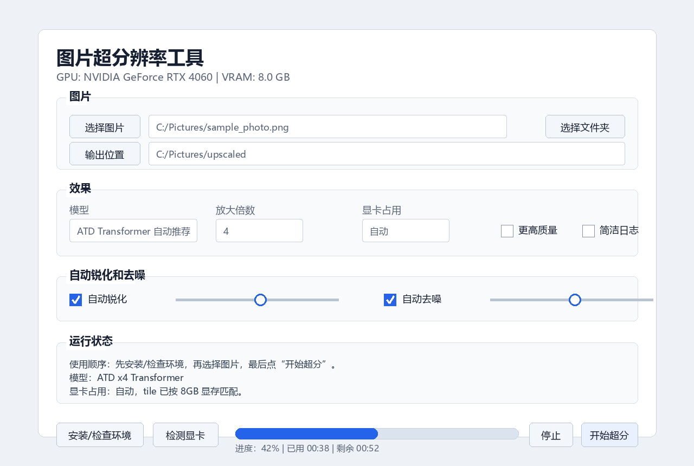
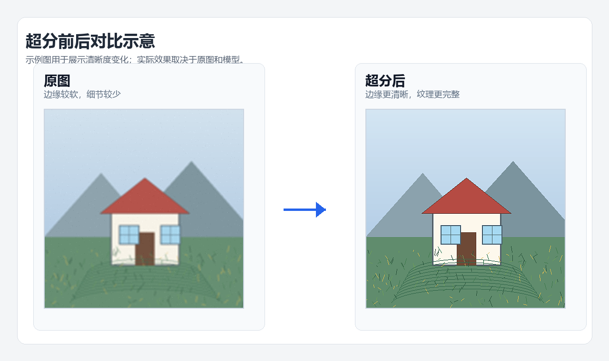

# 图片超分辨率工具

[](https://github.com/qwertasdfg77/image-super-resolution-tool/actions/workflows/python-check.yml)
[](https://github.com/qwertasdfg77/image-super-resolution-tool/actions/workflows/codeql.yml)
[](LICENSE)


Windows 图片超分辨率工具 / CUDA auto-tuned image upscaler with Transformer model support.

这是一个无需写代码的 Windows 图形界面图片超分工具，支持 NVIDIA CUDA 显卡自动识别、显存自动匹配、ATD Transformer 超分模型、自动锐化和自动去噪。

English README: [README.en.md](README.en.md)





## 推荐下载方式

打开 [v1.0.1 完整包下载](https://github.com/qwertasdfg77/image-super-resolution-tool/releases/tag/v1.0.1)，优先下载：

```text
ImageSuperResolutionToolWebSetup.exe
```

双击运行后，它会自动下载完整包、合并分卷、校验 SHA256、解压并创建快捷方式。

如果不想用安装器，也可以手动下载下面 4 个文件到同一个文件夹：

- `image-super-resolution-tool-full.zip.001`
- `image-super-resolution-tool-full.zip.002`
- `merge-full-package.ps1`
- `SHA256.txt`

在这个文件夹里打开 PowerShell，运行：

```powershell
powershell -ExecutionPolicy Bypass -File .\merge-full-package.ps1
```

等它生成 `image-super-resolution-tool-full.zip`，解压后进入 `image-super-resolution-tool` 文件夹，双击 `start_gui.bat`。

如果完整包里的运行环境在你的电脑上不可用，双击 `install_gpu.bat` 重新安装一次即可。

## 适合谁

- 想把照片、截图、游戏画面、动漫图放大到 2 倍、3 倍或 4 倍的用户。
- 有 NVIDIA 显卡，推荐 RTX 4060 8GB 或更高。
- 想直接双击使用，不想写代码或手动调命令行参数的用户。

## 功能

- 自动识别显卡型号、显存容量和当前空闲显存。
- 自动选择 tile、显存占用上限和推理精度。
- 默认使用 ATD x4 Transformer 模型。
- 支持 Real-ESRGAN 照片/动漫备用模型。
- 自动锐化和自动去噪。
- 百分比进度条，显示已用时间和预计剩余时间。
- 支持单张图片和整个文件夹批量处理。

## 使用源码版

源码仓库不包含 `.venv` 和模型权重。第一次使用请运行：

```text
安装运行环境.bat
```

安装完成后运行：

```text
start_gui.bat
```

第一次超分会自动下载模型权重到 `models` 文件夹。

## 说明

这个工具不是游戏里的原生 DLSS。原生 DLSS 需要游戏引擎提供多帧、运动向量和深度信息；本工具处理的是单张图片或图片文件夹。

超分前后对比图是示意图，用于展示清晰度变化；实际效果取决于原图质量、图片类型和选择的模型。

更多细节见 [README_super_resolution.md](README_super_resolution.md)。常见问题见 [FAQ.md](FAQ.md)。完整包下载说明见 [RELEASE_DOWNLOAD.md](RELEASE_DOWNLOAD.md)。更新记录见 [CHANGELOG.md](CHANGELOG.md)。

第三方组件和模型说明见 [THIRD_PARTY_NOTICES.md](THIRD_PARTY_NOTICES.md)。使用支持见 [SUPPORT.md](SUPPORT.md)。安全说明见 [SECURITY.md](SECURITY.md)。
